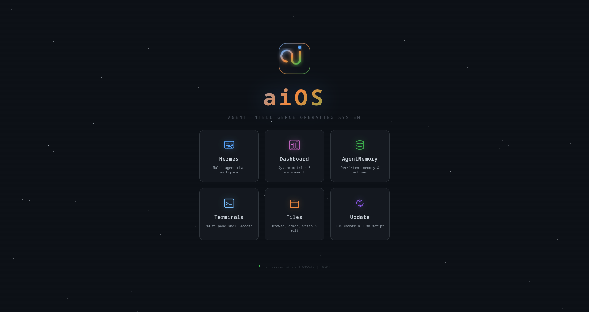
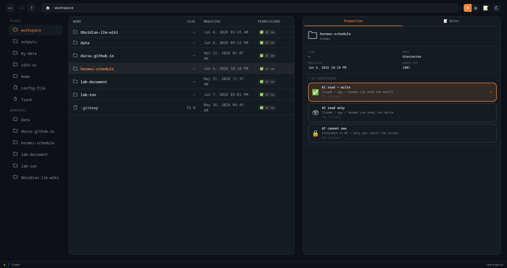
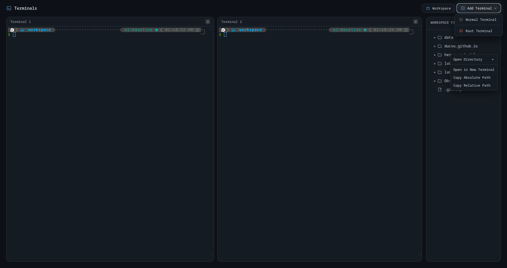

# aiOS: Agent Intelligence Operating System for Workspace (v2.0)

<div align="center">
  
</div>

This repository houses a secure, GPU-accelerated workspace for AI agents.

By leveraging the **Sidecar Pattern**, it isolates the heavy AI sandbox from your host machine while providing a web control panel in the background to manage installations, file permissions, and shared directories.

---

## 💻 Cross-Platform Support

`aiOS-ui` is fully containerized and engineered to run seamlessly across all desktop operating systems:
- **macOS** (Apple Silicon M1/M2/M3/M4 & Intel via Docker Desktop / OrbStack)
- **Windows** (Windows 10/11 via Docker Desktop with WSL2 or PowerShell)
- **Linux** (Ubuntu, Fedora, Debian, Arch via Docker Engine)

---

## ⚡ Quick Start: 1-Command Auto-Installer

Run the automated installer to set up all bind-mount directories, environment files, and boot the containers:

### macOS / Linux / WSL2:
```bash
cd aiOS-ui && make install
# Or run directly:
cd aiOS-ui && bash install.sh
```

### Windows (PowerShell):
```powershell
cd aiOS-ui
.\install.ps1
```

---

## 🐧 Linux Systemd Auto-Start on Boot

To automatically start `aiOS-ui` on every Linux system boot without needing to open a terminal:

```bash
# 1. Install the user systemd unit file
mkdir -p ~/.config/systemd/user
cp aiOS-ui/config-file/system-config/aios-ui.service ~/.config/systemd/user/aios-dashboard.service

# 2. Enable systemd user lingering & Docker daemon autostart
loginctl enable-linger $USER
sudo systemctl enable docker

# 3. Enable and start the systemd user service
systemctl --user daemon-reload
systemctl --user enable aios-dashboard.service
systemctl --user start aios-dashboard.service
```

### Systemd Management Commands:
- **Check Status**: `systemctl --user status aios-dashboard.service`
- **Restart Service**: `systemctl --user restart aios-dashboard.service`
- **Stop Service**: `systemctl --user stop aios-dashboard.service`

---

## 🛠️ Management Commands (`Makefile`)

All container operations are managed via cross-platform `make` commands inside the `aiOS-ui` directory:

| Command | Description |
| :--- | :--- |
| **`make install`** | Auto-installer (creates directories, `.env`, builds & boots container) |
| **`make up`** | Build and start container in Universal CPU/Metal mode |
| **`make up-gpu`** | Build and start container with NVIDIA GPU passthrough |
| **`make down`** | Stop container services |
| **`make build`** | Rebuild container image |
| **`make shell`** | Attach interactive `zsh` shell inside sandbox user workspace |
| **`make root-shell`** | Attach interactive `zsh` shell as `root` |
| **`make logs`** | Tail container execution logs |

---

## 🖼️ Features & Screenshots

### Multi-pane Workspace Terminals

### Secure File Browser

Browse, manage files, and configure AI read/write boundaries visually.



### File & Folder Context Menu Actions

Right-click any file or directory in the workspace browser to run quick terminal operations. Includes natural-language actions like **Open Directory**, **Edit File**, and **View File**, which automatically determine the target terminal pane and run the corresponding commands. Features viewport collision detection to flip submenus to the left if opened near the screen's right edge.



---

## 📖 Project Structure

```text
my-assistance/
├── .gitignore                   # Anti-leak protections & heavy file ignores
├── README.md                    # Root workspace documentation
│
├── sandbox-data/                # Docker bind-mounts for persistent working files
│   ├── working-space/           # Mapped to /workspace (code & scripts)
│   ├── my-data/                 # Mapped to /my-data (heavy datasets — read-only, gitignored)
│   └── outputs/                 # Mapped to /outputs (generated results — gitignored)
│
└── aiOS-ui/                     # Main Web control panel & Docker project root
    ├── Dockerfile               # Software blueprint for the AI sandbox & tools
    ├── docker-compose.yml       # Universal cross-platform wiring (ports, volumes)
    ├── docker-compose.gpu.yml   # NVIDIA GPU passthrough override
    ├── Makefile                 # Cross-platform build/run shortcuts
    ├── install.sh               # POSIX auto-installer (Linux / macOS / WSL2)
    ├── install.ps1              # Windows PowerShell auto-installer
    ├── environment.yml          # Deep ML & signal processing conda baseline
    │
    ├── config-file/             # Persistent configs bind-mounted into container
    ├── persistent/              # Persistent runtime storage & user settings
    │
    └── features/                # Application feature services
        ├── dashboard/           # FastAPI BFF Dashboard (port 8788 / 9119)
        └── hermes-webui/        # Hermes WebUI application (server.py on port 8501)
```

---

## 🔧 Recovery & Diagnostics

If background services stop responding after system sleep or container restarts, run the automated recovery script inside the container shell:

```bash
cd aiOS-ui && make shell
bash /config-file/system-config/recover.sh
```
